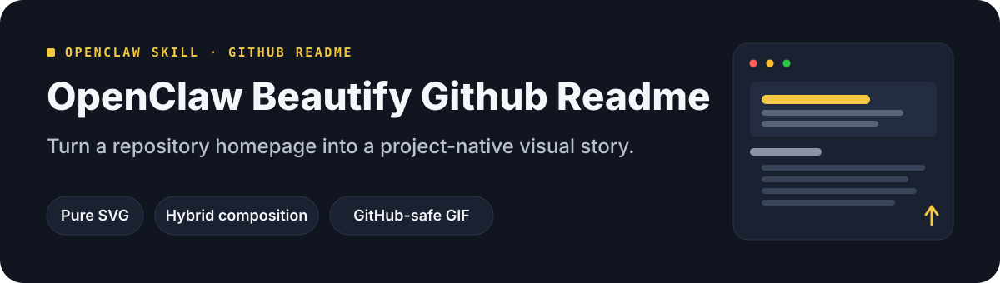

# OpenClaw Beautify Github Readme 🎨

<div align="center">
  <a href="README.md">🇨🇳 中文</a> | <strong>🌐 English</strong>
</div>

<p align="center">
  
</p>

> Turn a repository homepage into a project-native visual story with GitHub-safe SVG.
> 把 GitHub README 从「信息堆」变成项目的视觉门面——先让人看懂，再谈视觉。

> **Based on the upstream [oil-oil/beautify-github-readme](https://github.com/oil-oil/beautify-github-readme) (MIT, 1.7k★)**: this project keeps the full upstream workflow and design guidance, and adds render-level visual verification, Windows / CJK font adaptation, and dark/light theme safety rules. Credit to the upstream maintainers.


## Why it exists

Most repositories already contain enough information — visitors just never get to it. They land on internal jargon, install commands, and a directory tree before learning what the project is actually for. Trying to fix that yourself usually hits these walls:

- ❌ **Wrong order**: the value is buried on the fifth screen, and the homepage keeps losing visitors
- ❌ **Template feel**: the same hero skin pasted onto every repo — swap the name and it could belong to anyone
- ❌ **GitHub constraints**: no CSS, no web fonts, no animation inside SVG; SVG ignores `prefers-color-scheme`, so assets can become unreadable on the reader's theme
- ❌ **Guessing instead of rendering**: SVG text does not wrap, overflows silently, and fails contrast — **you cannot see problems until you render**, and static checks miss them
- ❌ **CJK mismatch**: font stacks without Microsoft YaHei fall back to SimSun on Windows, breaking width and layout for Chinese text

This Skill treats a README as two layers: **Markdown owns the content** (searchable, copyable, maintainable) and **SVG owns the visuals** (editable, scalable, GitHub-safe) — with built-in render-level verification so "looks fine locally, breaks on GitHub" stops happening.

## Features

- 🏠 **Two explicit modes**: whole-README redesign (reorder the story + build a visual system) / asset-only (hero, section headers, workflow, badges — README untouched, byte for byte)
- 🎨 **Project-native**: read the repository first, then derive palette, type, and motifs from *it* — never the same template twice
- 🧩 **Three implementations**: pure SVG (deterministic, hand-editable) / hybrid SVG composition (SVG layout + AI-generated cutout subject) / GitHub-safe GIF (motion is opt-in; the SVG stays as the editable source)
- 🛡️ **Render-level verification** (upgrade): `scripts/visual_verify.py` renders every SVG with headless Chrome/Edge → WCAG text-contrast checks → edge-clipping scan → PNG previews. Cross-platform, one command
- 🌏 **Windows / CJK adaptation** (upgrade): Microsoft YaHei in the font stack (no more SimSun fallback on Windows); CJK ≈1em / Latin ≈0.5em width guidance
- 🌗 **Theme-safety rules** (upgrade): SVG cannot adapt to the reader's theme → opaque container or dual-endpoint contrast rules, written down as hard requirements
- 🔍 **Read-only audit**: understand what is unclear or unevidenced before touching anything
- 🤝 **Optional attribution**: a project-native "README MADE WITH" signature only after you approve, never bundled or required

## What it can produce

The same method grows different visuals on different projects — CLIs use command rhythm and cursors, icon systems use keylines and cutouts, research repos use coordinates and evidence labels:

<p align="center">
  
</p>

## Differences from upstream beautify-github-readme

| Capability | Upstream | This version |
|---|---|---|
| Two-mode workflow / 8 design references | ✅ | ✅ fully kept |
| Static audit `audit_readme.py` | ✅ | ✅ kept |
| **Render-level verification** (Chrome headless + WCAG + edge scan) | ❌ eyeball only | ✅ `visual_verify.py` |
| **Windows font adaptation** (YaHei / fallback risk) | ❌ PingFang SC only | ✅ built-in |
| **Theme-safety hard rules** (container or dual-endpoint contrast) | ⚠️ hint only | ✅ codified |
| Chinese support | ⚠️ README translation only | ✅ Chinese-first + bilingual README |
| Assets / showcase | upstream-branded | ✅ fully re-made, no upstream logo remnants |

## Install

This repository *is* the skill package (Agent Skills layout, SKILL.md at the root):

```bash
git clone https://github.com/dtsola/xiaoyaoclaw-beautify-github-readme
```

**Option A — into your AI tool's skills directory**
```bash
# OpenClaw      → copy into your skills dir (or install via ClawHub)
# Claude Code   → ~/.claude/skills/xiaoyaoclaw-beautify-github-readme/
# Codex         → ~/.codex/skills/
# Other tools   → the matching Agent Skills directory
```

**Option B — per-repository**
```bash
# Drop SKILL.md + references/ + scripts/ into the repo's .agents/skills/
```

## Quick start (3 steps)

### Step 1 — Tell your Agent the goal

> Use the beautify skill to redesign this repository homepage around its real project theme. Show me a local preview first and do not push anything.

The Skill confirms scope first (whole README vs asset-only), then reads the repository and extracts the project story.

### Step 2 — Verify locally

```bash
python3 scripts/audit_readme.py README.md          # static: refs / XML / alt
python3 scripts/visual_verify.py README.md --out /tmp/previews   # render-level: contrast / edges
```

`visual_verify.py` auto-detects Chrome/Edge, renders every SVG, and drops PNG previews — inspect them at ~900px content width and 360px mobile (or ask a vision model).

### Step 3 — Publish only after you approve

The Skill never commits, pushes, or opens PRs without explicit authorization.

## Layout

```
xiaoyaoclaw-beautify-github-readme/
├── SKILL.md                    # Skill body (two-mode workflow + gates + quality bar)
├── README.md / README.en.md    # This file (bilingual)
├── references/                 # Design guidance, loaded on demand
│   ├── visual-direction.md     # Theme-specific visual system
│   ├── project-native-hero.md  # Designing the hero from project content
│   ├── svg-production.md       # GitHub-safe SVG (incl. theme safety)
│   ├── hybrid-svg-production.md# SVG + generated raster composition
│   ├── motion-production.md    # GitHub-safe GIF production
│   ├── github-readme-canvas.md # Canvas & typography scale
│   ├── content-architecture.md # Copy sequencing & deletion rules
│   └── showcase-contribution.md# Showcase & attribution
├── scripts/
│   ├── visual_verify.py        # Render-level verification ★upgrade
│   ├── audit_readme.py         # Static audit
│   └── render_motion_gif.py    # SVG → GitHub-safe GIF
├── assets/readme/              # README showcase assets (bilingual)
└── LICENSE
```

## License

MIT — upgraded from [beautify-github-readme](https://github.com/oil-oil/beautify-github-readme) (MIT). Credit to the upstream maintainers.

---

## 🛠️ Custom work?

**Agent & Skills customization from ¥800.**

- WeChat: `dtsola` (note: **openclaw定制**)
- Scope: README visual redesign / OpenClaw multi-agent setup / custom Skill development / agent memory systems

## 💬 Community

Xiaoyao product user group — feedback · tips · feature requests:

<p align="center">
  
</p>

<p align="center">Scan to join, or add WeChat <code>dtsola</code> (note: <b>加群</b>)</p>

## Sister projects

- 🏠 **xiaoyaoclaw-workspace-initializer**: standard workspace + WORKSPACE.md rules + multi-agent config safety.<https://github.com/dtsola/xiaoyaoclaw-workspace-initializer>
- 🧠 **xiaoyaoclaw-memory-distill**: distill conversations into structured memory (semantic levels + first-run build + dedup + sensitive skip).<https://github.com/dtsola/xiaoyaoclaw-memory-distill>
- 🗂️ **xiaoyaoclaw-task-progress-tracker**: directory-as-container, PROGRESS.md-as-status for tasks/ and projects/.<https://github.com/dtsola/xiaoyaoclaw-task-progress-tracker>
- 📚 **xiaoyaoclaw-kb-retriever**: local knowledge-base retrieval (layered index + progressive search, md/pdf/xlsx, zero-dep).<https://github.com/dtsola/xiaoyaoclaw-kb-retriever>
- 🩹 **xiaoyaoclaw-workspace-auditor**: read-only workspace health audit with graded reports.<https://github.com/dtsola/xiaoyaoclaw-workspace-auditor>
- 📎 **xiaoyaoclaw-web-clipper**: any web page → clean local Markdown with frontmatter, dual-engine extraction.<https://github.com/dtsola/xiaoyaoclaw-web-clipper>
- 🤝 **xiaoyaoclaw-agent-orchestrator**: split, dispatch, track, aggregate, retry across agents.<https://github.com/dtsola/xiaoyaoclaw-agent-orchestrator>
- 📊 **xiaoyaoclaw-usage-report**: parse session JSONL — task duration / tools / models / token usage, local-only.<https://github.com/dtsola/xiaoyaoclaw-usage-report>
- 🎛️ **xiaoyaoclaw-commander** (OpenClaw Cross-Tool Commander): drive OpenClaw from any Agent Skills tool.<https://github.com/dtsola/xiaoyaoclaw-commander>
- 🔍 **xiaoyaoclaw-seo-skill**: SEO analysis & optimization — audit/page/content/schema/geo + zero-dep audit script.<https://github.com/dtsola/xiaoyaoclaw-seo-skill>
