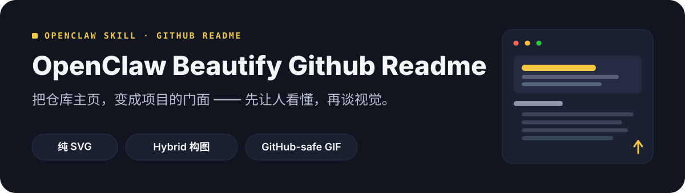

# OpenClaw Beautify Github Readme 🎨

<div align="center">
  <strong>🇨🇳 中文</strong> | <a href="README.en.md">🌐 English</a>
</div>

<p align="center">
  
</p>

> 把 GitHub README 从「信息堆」变成项目的视觉门面——先让人看懂，再谈视觉。
> Turn a repository homepage into a project-native visual story with GitHub-safe SVG.

> **基于上游升级**：本项目由 [oil-oil/beautify-github-readme](https://github.com/oil-oil/beautify-github-readme)（MIT，1.7k★）本地升级而来，完整保留上游工作流与设计规范，并补强**渲染级验证自动化、Windows / 中文字体适配、深浅双主题安全**。致谢上游作者。


## 为什么需要它

很多仓库的信息其实已经够了，只是没人愿意看。访客一上来看到内部术语、安装命令和目录树，却还不知道这个项目是做什么的。想改，又踩这些坑：

- ❌ **顺序混乱**：功能藏在第 5 屏，价值要靠猜——README 是门面，却劝退访客
- ❌ **模板感**：套同一个 hero 模板换皮，配色字体跟项目毫无关系，换掉名字哪都能用
- ❌ **GitHub 限制**：不能像网页那样用 CSS/动画/远程字体；SVG 不吃 `prefers-color-scheme`，深浅主题下可能直接看不清
- ❌ **预览靠猜**：SVG 文字不换行、溢出、对比度不足——**不渲染出来根本看不见**，纯静态检查抓不到
- ❌ **中文失配**：字体栈没有微软雅黑，Windows 渲染回退宋体，中英混排字宽全乱

这个技能把 README 当**内容 + 视觉两层**来做：Markdown 管内容（可搜索、可复制、可维护），SVG 管视觉（可编辑、可缩放、GitHub-safe），并内置渲染级验证，杜绝「图看起来挺好、一上 GitHub 就翻车」。

## 特性

- 🏠 **双模式**：整份 README 优化（重排信息 + 建立视觉系统）/ asset-only（只做 hero、章节标题、流程图、徽章等素材，README 一字不动）
- 🎨 **项目原生**：先读懂仓库，再定配色/字体/图形语言——每个项目一套视觉，不是一份模板打天下
- 🧩 **三种实现**：纯 SVG（确定性、可编辑）/ Hybrid SVG 构图（SVG 排版 + AI 生图抠图素材）/ GitHub-safe GIF（动效须明确选择，SVG 保留为源文件）
- 🛡️ **渲染级验证自动化**（升级点）：`scripts/visual_verify.py` 用 Chrome/Edge 无头渲染每张 SVG → WCAG 文字对比度检查 → 边缘贴边检测 → 输出 PNG 供复核，跨平台一条命令
- 🌏 **Windows / 中文字体适配**（升级点）：字体栈内置微软雅黑（Windows 不再回退宋体），中英混排字宽指导（CJK ≈1em / 拉丁 ≈0.5em）
- 🌗 **深浅双主题安全规则**（升级点）：SVG 无法自适应主题 → 不透明容器 or 透明底双端对比度硬规则，杜绝「深色图在浅色页看不清」
- 🔍 **只读审计**：不动文件，先告诉你 README 哪里难懂、哪里缺证据
- 🤝 **归因可选**：满意后可选加「README MADE WITH」项目原生签名，纯自愿不捆绑

## 它能做出什么

同一套方法，在不同项目上长出完全不同的视觉——终端工具用命令节奏与光标，图标系统用网格与切片，研究项目用坐标与证据标签：

<p align="center">
  
</p>

## 与上游 beautify-github-readme 的区别

| 能力 | 上游 | 本版（OpenClaw Beautify Github Readme） |
|---|---|---|
| 双模式工作流 / references 设计规范（8 篇） | ✅ | ✅ 完整保留 |
| 静态审计 `audit_readme.py` | ✅ | ✅ 保留 |
| **渲染级视觉验证**（Chrome 无头渲染 + WCAG + 贴边） | ❌ 靠肉眼 | ✅ `visual_verify.py` |
| **Windows 字体适配**（微软雅黑 / 回退风险） | ❌ 仅 PingFang SC | ✅ 内置 |
| **双主题安全硬规则**（容器 or 双端对比度） | ⚠️ 仅提示检查 | ✅ 规范成文 |
| 中文支持 | ⚠️ 仅 README 翻译 | ✅ 中文为主 + 中英双语 README |
| 素材/案例 | 上游 branding 素材 | ✅ 全部重制，无上游 logo 残留 |

## 安装

本仓库即技能包（Agent Skills 标准结构，SKILL.md 在根目录）：

```bash
git clone https://github.com/dtsola/xiaoyaoclaw-beautify-github-readme
```

**用法 A：OpenClaw / Claude Code / Codex 等（技能目录）**
```bash
# OpenClaw   → 复制到 skills 目录（或 ClawHub 安装）
# Claude Code → ~/.claude/skills/xiaoyaoclaw-beautify-github-readme/
# Codex       → ~/.codex/skills/
# 其他工具    → 对应 Agent Skills 目录
```

**用法 B：临时给某个仓库用**
```bash
# 把 SKILL.md + references/ + scripts/ 放进仓库的 .agents/skills/ 即可
```

## 快速上手（三步）

### Step 1：告诉 AI 你的目标

对你的 Agent 说：

> 用 beautify 技能重新设计这个仓库的 GitHub 主页，风格根据项目主题决定。先给我本地预览，不要推送。

技能会先确认范围（整份 README 还是只做素材），再读仓库提取项目故事。

### Step 2：本地验证

README 模式改完后，跑双脚本验证：

```bash
python3 scripts/audit_readme.py README.md          # 静态：引用 / XML / alt
python3 scripts/visual_verify.py README.md --out /tmp/previews   # 渲染级：对比度 / 贴边
```

`visual_verify.py` 自动找 Chrome/Edge 渲染每张 SVG 并输出 PNG 预览——交给 AI 视觉复核，或直接肉眼检查 900px / 360px 两种宽度。

### Step 3：满意后再发布

未经你确认，技能不会 commit / push / 发 PR。确认预览后让它落地即可。

## 目录结构

```
xiaoyaoclaw-beautify-github-readme/
├── SKILL.md                    # 技能本体（双模式流程 + 门控 + 质量红线）
├── README.md / README.en.md    # 本文件（中英双语）
├── references/                 # 按需加载的设计规范
│   ├── visual-direction.md     # 主题化视觉系统定义
│   ├── project-native-hero.md  # 从项目内容设计 hero
│   ├── svg-production.md       # GitHub-safe SVG 写法（含双主题安全）
│   ├── hybrid-svg-production.md# SVG + AI 生图混合构图
│   ├── motion-production.md    # GitHub-safe GIF 制作
│   ├── github-readme-canvas.md # 画布与排版规范
│   ├── content-architecture.md # 文案顺序与删减规则
│   └── showcase-contribution.md# 案例收录与归因
├── scripts/
│   ├── visual_verify.py        # 渲染级验证（Chrome 无头 + WCAG + 贴边）★升级
│   ├── audit_readme.py         # 静态审计
│   └── render_motion_gif.py    # SVG → GitHub-safe GIF
├── assets/readme/              # README 展示资产（中英双语）
└── LICENSE
```

## License

MIT — 基于 [beautify-github-readme](https://github.com/oil-oil/beautify-github-readme)（MIT）升级，致谢上游作者。

---

## 🛠️ 需要定制？

**Agent & Skills 定制，价格 ¥800 起。**

- 微信：`dtsola`（添加好友时备注：**openclaw定制**）
- 服务范围：README 视觉改造 / OpenClaw 多 agent 部署 / 自定义 Skill 开发 / agent 记忆系统搭建

## 💬 加入交流群

小遥全系产品用户交流群——产品反馈 · 使用交流 · 功能建议：

<p align="center">
  
</p>

<p align="center">扫码加群，或添加微信 <code>dtsola</code>（备注：<b>加群</b>）</p>

## 姊妹项目

- 🏠 **xiaoyaoclaw-workspace-initializer**（工作区初始化器）：给每个 agent 一个「家」——标准目录结构 + WORKSPACE.md 规范 + 多 agent 配置安全。<https://github.com/dtsola/xiaoyaoclaw-workspace-initializer>
- 🧠 **xiaoyaoclaw-memory-distill**（记忆蒸馏）：把对话蒸馏成结构化记忆——语义分级 + 首次建忆 + 增量去重 + 敏感跳过。<https://github.com/dtsola/xiaoyaoclaw-memory-distill>
- 🗂️ **xiaoyaoclaw-task-progress-tracker**（任务进度跟踪器）：目录即容器，PROGRESS.md 即进度——tasks/ 与 projects/ 生命周期管理。<https://github.com/dtsola/xiaoyaoclaw-task-progress-tracker>
- 📚 **xiaoyaoclaw-kb-retriever**（知识库检索器）：本地知识库检索——分层索引 + 渐进式检索（md/pdf/xlsx），零依赖零 API key。<https://github.com/dtsola/xiaoyaoclaw-kb-retriever>
- 🩹 **xiaoyaoclaw-workspace-auditor**（工作区体检）：只读审计 5 类健康度 + 分级报告 + 修复建议，零依赖脚本永不改文件。<https://github.com/dtsola/xiaoyaoclaw-workspace-auditor>
- 📎 **xiaoyaoclaw-web-clipper**（网页剪藏）：任意网页 → 带 frontmatter 的本地 Markdown，双引擎正文提取降级链，输出直通知识库。<https://github.com/dtsola/xiaoyaoclaw-web-clipper>
- 🤝 **xiaoyaoclaw-agent-orchestrator**（Agent 协作编排）：拆任务、分 agent、管进度、聚结果、失败重试。<https://github.com/dtsola/xiaoyaoclaw-agent-orchestrator>
- 📊 **xiaoyaoclaw-usage-report**（用量报告）：解析 session JSONL，回答「任务耗时 / 工具技能 / token 消耗」——零依赖纯本地。<https://github.com/dtsola/xiaoyaoclaw-usage-report>
- 🎛️ **xiaoyaoclaw-commander**（OpenClaw Cross-Tool Commander）：让任意支持 Agent Skills 的工具指挥小遥Claw / OpenClaw 多 agent 系统。<https://github.com/dtsola/xiaoyaoclaw-commander>
- 🔍 **xiaoyaoclaw-seo-skill**（SEO Skill）：网站搜索可见性分析与优化——audit/page/content/schema/geo 五流程 + 零依赖审计脚本。<https://github.com/dtsola/xiaoyaoclaw-seo-skill>
